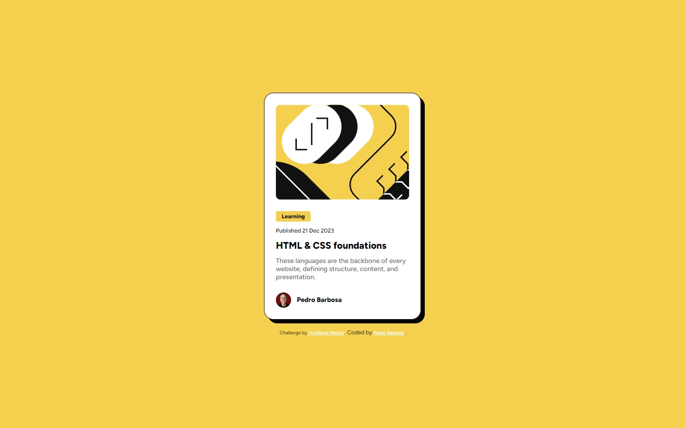

# Frontend Mentor - Solução do cartão de pré-visualização de blog

Esta é uma solução para o [desafio do cartão de pré-visualização de blog no Frontend Mentor](https://www.frontendmentor.io/challenges/blog-preview-card-ckPaj01IcS). Os desafios do Frontend Mentor ajudam você a melhorar suas habilidades de codificação construindo projetos realistas.

## Tabela de conteúdos

- [Visão Geral](#visão-geral)
  - [O desafio](#o-desafio)
  - [Captura de tela](#captura-de-tela)
  - [Links](#links)
- [Meu processo](#meu-processo)
  - [Construído com](#construído-com)
  - [O que eu aprendi](#o-que-eu-aprendi)
- [Autor](#autor)

**Nota: Exclua esta nota e atualize a tabela de conteúdos com base nas seções que você manter.**

## Visão Geral

### O desafio

Os usuários devem ser capazes de:

- Ver estados de foco e hover para todos os elementos interativos na página

### Captura de tela

### Links

- URL do site ao vivo: [Adicione a URL do site ao vivo aqui](https://your-live-site-url.com)

## Meu processo

### Construído com

- Marcação HTML5 semântica
- Propriedades personalizadas de CSS
- Flexbox
- Grid de CSS
- Fluxo de trabalho mobile-first

### O que eu aprendi

Trabalhar com mobile-first, estou aos poucos tentando criar autonômia com esse padrão.
